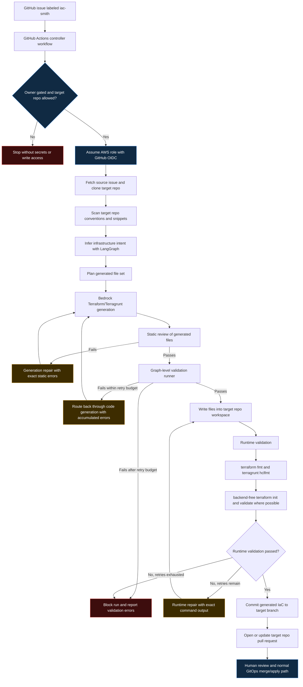

# IaC Smith Architecture Flow

This diagram shows the controller flow from issue trigger to reviewable infrastructure pull request. IaC Smith generates and repairs IaC, but it never applies infrastructure directly.

## Control boundaries

- The controller repo orchestrates issue intake, generation, validation, repair, and PR creation.
- The target repo remains the source of truth for Terraform/Terragrunt.
- IaC Smith does not run `terraform apply`. Human review and the target repo's normal GitOps process remain the deployment boundary.
- Repair loops are bounded. If generated IaC cannot be made safe and valid within the retry budget, the controller blocks rather than opening a misleading PR.

## Validation boundaries

Runtime validation is conservative by design. New infrastructure may not have remote state or dependency outputs yet, so IaC Smith focuses on formatting, backend-free initialization, and module-level Terraform validation where possible. Full environment planning remains dependent on target repo state, credentials, and dependency readiness.
