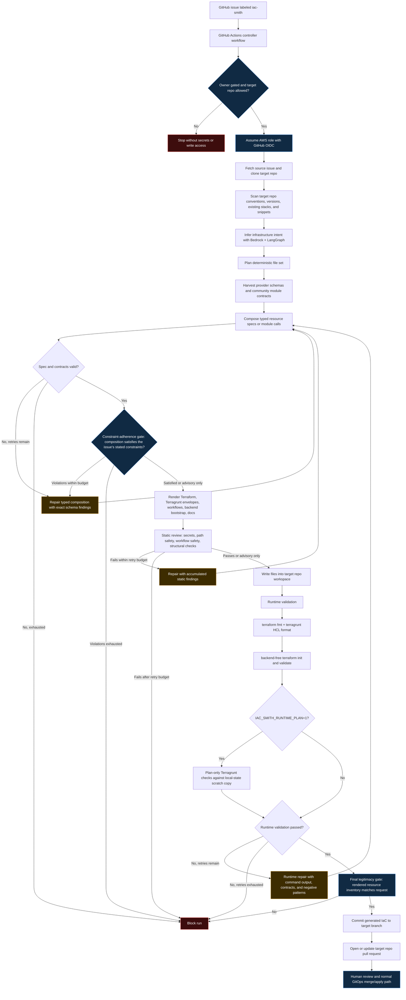
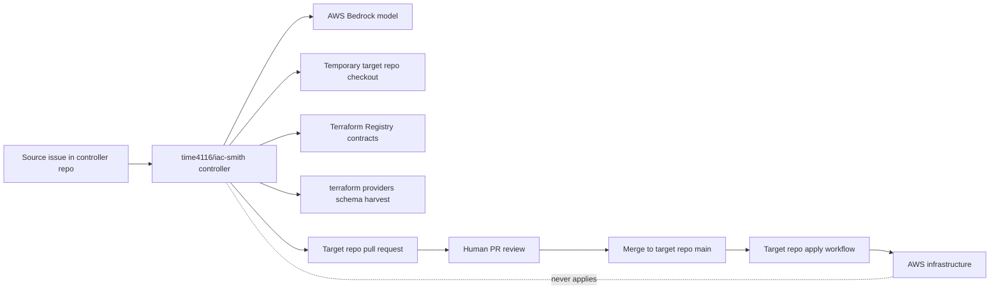

# IaC Smith Architecture Flow

This document shows the controller flow from issue trigger to reviewable infrastructure pull request. IaC Smith generates and repairs IaC, but it never applies infrastructure directly.

## Run lifecycle

```mermaid
flowchart TD
    A[GitHub issue labeled iac-smith] --> B[GitHub Actions controller workflow]
    B --> C{Owner gated and target repo allowed?}
    C -- No --> Z[Stop without secrets or write access]
    C -- Yes --> D[Assume AWS role with GitHub OIDC]
    D --> E[Fetch source issue and clone target repo]
    E --> F[Scan target repo conventions, versions, existing stacks, and snippets]
    F --> G[Infer infrastructure intent with Bedrock + LangGraph]
    G --> H[Plan deterministic file set]
    H --> I[Harvest provider schemas and community module contracts]
    I --> J[Compose typed resource specs or module calls]
    J --> K{Spec and contracts valid?}
    K -- No, retries remain --> J1[Repair typed composition with exact schema findings]
    J1 --> J
    K -- No, exhausted --> N[Block run]
    K -- Yes --> KA{Constraint-adherence gate: composition satisfies the issue's stated constraints?}
    KA -- Violations within budget --> J1
    KA -- Violations exhausted --> N
    KA -- Satisfied or advisory only --> L[Render Terraform, Terragrunt envelopes, workflows, backend bootstrap, docs]
    L --> M[Static review: secrets, path safety, workflow safety, structural checks]
    M -->|Fails within retry budget| J2[Repair with accumulated static findings]
    J2 --> J
    M -->|Fails after retry budget| N
    M -->|Passes or advisory only| O[Write files into target repo workspace]
    O --> P[Runtime validation]
    P --> P1[terraform fmt + terragrunt HCL format]
    P1 --> P2[backend-free terraform init and validate]
    P2 --> P3{IAC_SMITH_RUNTIME_PLAN=1?}
    P3 -- Yes --> P4[Plan-only Terragrunt checks against local-state scratch copy]
    P3 -- No --> Q{Runtime validation passed?}
    P4 --> Q
    Q -- No, retries remain --> R[Runtime repair with command output, contracts, and negative patterns]
    R --> J
    Q -- No, retries exhausted --> N
    Q -- Yes --> S[Final legitimacy gate: rendered resource inventory matches request]
    S -- No --> N
    S -- Yes --> T[Commit generated IaC to target branch]
    T --> U[Open or update target repo pull request]
    U --> V[Human review and normal GitOps merge/apply path]

    classDef safety fill:#102a43,stroke:#58a6ff,color:#ffffff
    classDef repair fill:#3d2c00,stroke:#d29922,color:#ffffff
    classDef stop fill:#3d0d0d,stroke:#f85149,color:#ffffff

    class C,D,Z,N,S,V,KA safety
    class J1,J2,R repair
    class Z,N stop
```

## System boundaries

```mermaid
flowchart LR
    Issue[Source issue in controller repo] --> Controller[time4116/iac-smith controller]
    Controller --> Bedrock[AWS Bedrock model]
    Controller --> TargetClone[Temporary target repo checkout]
    Controller --> Registry[Terraform Registry contracts]
    Controller --> ProviderSchemas[terraform providers schema harvest]
    Controller --> PR[Target repo pull request]
    PR --> Review[Human PR review]
    Review --> Merge[Merge to target repo main]
    Merge --> ApplyWorkflow[Target repo apply workflow]
    ApplyWorkflow --> AWS[AWS infrastructure]

    Controller -. never applies .- AWS
```

## Control boundaries

- The controller repo orchestrates issue intake, generation, validation, repair, and PR creation.
- The target repo remains the source of truth for Terraform/Terragrunt.
- IaC Smith does not run `terraform apply`. Human review and the target repo's normal GitOps process remain the deployment boundary.
- Repair loops are bounded. If generated IaC cannot be made safe and valid within the retry budget, the controller blocks rather than opening a misleading PR.
- `IAC_SMITH_ALLOWED_TARGET_REPO` is a hard allowlist. The run fails closed if `IAC_SMITH_TARGET_REPO` does not match exactly.

## Validation boundaries

Runtime validation is conservative by design. New infrastructure may not have remote state or dependency outputs yet, so IaC Smith always runs formatting and backend-free module-level Terraform validation first.

Optional runtime planning is enabled with `IAC_SMITH_RUNTIME_PLAN=1`. That path copies the generated tree to a scratch directory, rewrites Terragrunt remote state to local state, and runs plan-only checks with dependency mock outputs. It never applies infrastructure.

## Constraint-adherence boundary

Schema validity, a clean plan, and a matching resource class can all hold while the composition still violates what the issue explicitly asked for. The showcase ECS run was the canonical case: the issue required tasks in the public subnets with public IPs, the composition used private subnets with `assign_public_ip` disabled, and the schema-valid, plan-clean, apply-clean stack was dead at runtime because Fargate had no egress path to pull its image or reach CloudWatch Logs.

The intent parser lifts explicit, checkable requirement statements from the issue text into `intent.constraints` (request-derived only — no curated vocabulary). After a composition passes the schema gate, one review call — preferring `BEDROCK_ESCALATION_MODEL_ID` when set, since checking is cheaper than generating and a separate pass breaks the composer's blind spot — returns `satisfied | violated | not_applicable` per constraint with evidence. Violations re-enter the bounded composition-repair loop and block when unresolved, the same fail-closed posture as every other gate. The same call answers a runtime-viability question (image pulls, log delivery, service reachability); those findings plus a deterministic unpinned-container-image lint are advisory — one repair round, then carried as PR assumptions. The gate keeps cloud semantics in the model, not in controller code, and is a no-op offline (`IAC_SMITH_ADHERENCE_GATE=0` or no model) where every existing gate still applies.

## Legitimacy boundary

The default typed-spec path fails closed on structure-only output. If Bedrock is unavailable, schema harvest fails, the spec composer is disabled, or rendered files contain no real workload resources matching the request, IaC Smith blocks instead of opening a misleading PR.

`IAC_SMITH_ALLOW_STRUCTURE_ONLY=1` is reserved for explicit offline or eval scenarios. When used, the PR body must disclose that validation scope is limited.
