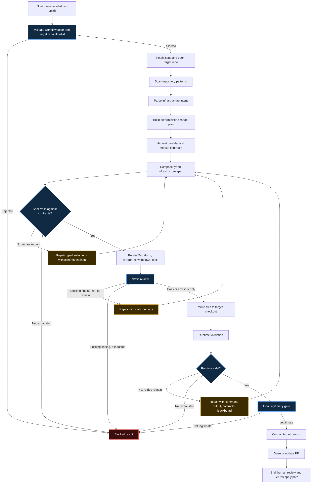

# LangGraph / StateGraph Flow

IaC Smith uses LangGraph to model infrastructure generation as explicit state transitions. The controller is not a single prompt that writes Terraform. It is a bounded graph that accumulates issue context, repo conventions, generated artifacts, validation findings, provider contracts, and block reasons as structured state.

The design goal is simple: open a PR only when the rendered Terraform/Terragrunt is safe, legitimate, and reviewable. Otherwise, block with a concrete reason.

This document describes the run conceptually. Not every stage below is a literal `StateGraph` node: the actual graph nodes are `issue_intake`, `intent_parser`, `ruleset_loader`, `repo_pattern_scanner`, `change_planner`, `blackboard_planner`, `code_generator`, `validation_runner`, and `pr_writer` (`graph.py`). Contract harvest and typed-spec composition run inside the generator invoked by `code_generator`, and the runtime repair loop and final legitimacy gate run in the CLI wrapper (`cli.py`) around the graph.

## Why LangGraph is used

LangGraph gives the controller a durable execution shape:

- Each node has one job.
- Intermediate results are stored in graph state instead of hidden prompt context.
- Validation failures become state that later repair nodes can consume.
- Routing decisions are explicit and testable.
- Retry loops are bounded so the run cannot repair forever.
- A failed safety or legitimacy gate can end the run without opening a misleading PR.

This matters for IaC because infrastructure correctness cannot rely on model confidence. The model proposes intent and typed resource selections; deterministic checks decide whether those proposals can become a PR.

## State model

The graph state carries the run's working memory. Conceptually it includes:

- Source issue metadata and body.
- Target repository identity and local checkout path.
- Parsed infrastructure intent.
- Discovered repository conventions and representative snippets.
- Loaded ruleset.
- Deterministic change plan.
- Provider schemas and community-module contracts.
- Generated or rendered file contents.
- Static review result.
- Runtime validation result.
- Accumulated validation findings and negative patterns.
- Run blackboard with learned contracts, prior failures, and repair context.
- Final rendered resource inventory.
- Block reason or PR metadata.

The important part is that validation findings are not discarded. They are promoted into state so later repair attempts can avoid repeating the same unsupported resource types, unsupported arguments, missing variables, or invalid plan-time values.

## Node responsibilities

### Issue and repository intake

Loads the source issue, validates the owner-gated workflow context, checks the target repository allowlist, and clones or opens the target infrastructure repo.

If `IAC_SMITH_TARGET_REPO` does not exactly match `IAC_SMITH_ALLOWED_TARGET_REPO`, the run blocks before any write path is available.

### Repository scanner

Inspects the target repo for Terraform/Terragrunt conventions:

- Existing environments.
- Existing stacks.
- Preferred layout.
- Representative `root.hcl`, `terragrunt.hcl`, module, and README snippets.
- Existing module sources and output contracts where available.
- Version files for Terraform/Terragrunt.

This lets IaC Smith adapt to an existing repo instead of always generating a greenfield layout.

### Intent parser

Converts the GitHub issue into structured infrastructure intent: environment, region, requested services, constraints, safety assumptions, and ambiguity notes.

The issue can remain freeform. The graph turns it into typed state before planning or generation starts.

### Change planner

Builds the deterministic file plan and high-level stack shape. This is where IaC Smith decides which files are allowed to exist in the output.

The planned file set becomes a boundary: generated paths outside the target repository or outside the expected plan are rejected.

### Contract harvest

Collects real provider and module contracts before or during composition:

- Provider resource types from `terraform providers schema -json`.
- Allowed arguments and nested blocks for selected resource types.
- Required arguments that must be represented in the spec.
- Terraform Registry community-module input and output contracts.

These contracts constrain the composer and later repair prompts. They also let IaC Smith reject hallucinated Terraform resource types before a PR is created.

### Spec composer

The default generator is the typed-spec composer. The model proposes JSON selections, not raw HCL:

- Provider resources.
- Community-module calls.
- Argument values.
- Nested blocks.
- References between resources.
- Module inputs and outputs.

The graph validates those proposals against harvested contracts. Invalid selections route back through repair while the retry budget remains.

### Deterministic renderer

Renders accepted specs into Terraform/Terragrunt and supporting repo files:

- Backend bootstrap.
- Environment `root.hcl` files.
- Stack `terragrunt.hcl` files.
- Module `main.tf`, `variables.tf`, `outputs.tf`, and `versions.tf`.
- Target-repo PR check and apply workflows.
- README/docs scaffolding where needed.

Deterministic rendering keeps file envelopes, Terragrunt includes, backend wiring, dependency mocks, and workflow safety rules out of the model's hands.

### Static review

Checks generated files before runtime validation. Blocking checks include secrets, unsafe workflow triggers, path safety, and other safety conditions that should never reach a PR.

Structural findings, such as duplicate declarations or missing required inputs, are fed back into repair and surfaced for review when appropriate.

### Runtime validation

Runs the real toolchain where possible:

- Terraform formatting.
- Terragrunt HCL formatting.
- Backend-free `terraform init` and `terraform validate` for modules and bootstrap roots.
- Provider schema harvesting after successful init.
- Optional local-state Terragrunt plans when `IAC_SMITH_RUNTIME_PLAN=1`.

Runtime failures become structured repair context. IaC Smith never runs `terraform apply`.

### Runtime repair

Routes exact command output, normalized validation findings, and harvested contracts back into the composer or generator.

Repair is targeted where possible. A module-level validation failure repairs the affected module files; a stack-level Terragrunt failure can also repair the corresponding module when the invalid value lives there.

Repair loops are capped. When the budget is exhausted, the run blocks.

### Final legitimacy gate

Before any branch is pushed, IaC Smith re-derives the resource inventory from rendered files.

The gate verifies that the PR contains real workload resources of the requested class and not only backend scaffolding, empty modules, placeholders, or failure banners. Structure-only output is blocked by default unless `IAC_SMITH_ALLOW_STRUCTURE_ONLY=1` is explicitly set for offline/eval use.

### PR writer

Creates or updates the target repo pull request only after validation and legitimacy pass.

The PR body is derived from rendered files and final validation state. It includes generated resources, backend resources, validation results, assumptions, warnings, Scope Monitoring, expected post-merge apply behavior, and an explicit confirmation that IaC Smith did not apply anything.

## Node flow

## Routing behavior

The graph has three successful routing patterns:

- Intent, plan, composition, validation, legitimacy, then PR.
- Static review failure, bounded repair, validation, legitimacy, then PR.
- Runtime validation failure, bounded repair, validation, legitimacy, then PR.

It has several intentional blocking paths:

- Target repo is not allowlisted.
- The issue cannot be interpreted safely.
- The change plan would require unsupported or overly broad work.
- The composer cannot produce contract-valid resource selections.
- Runtime validation continues to fail after repair attempts.
- The final resource inventory is backend-only, placeholder-only, or not aligned with the requested infrastructure.

## Relationship to the architecture flow

[ARCHITECTURE_FLOW.md](ARCHITECTURE_FLOW.md) describes the system boundary: controller repo, Bedrock, target repo, PR review, and target apply workflow.

This document describes the controller's internal graph: how state moves between nodes, where validation findings are accumulated, and why repair is bounded before PR creation.
